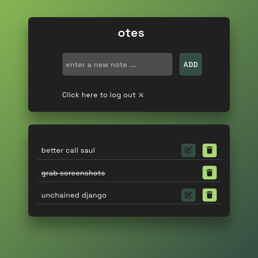
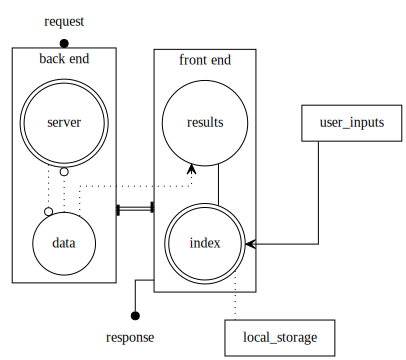

# About

-   Final Project -> Part II

## Description

-   This second version of my final project is a todo/note taking app, which implements the following enhancements:
    1.  the CRUD model
    2.  Jinja templating
    3.  use of a database instead of our trusted text file
    4.  login authentication

## Install & Run

1.  create a new environment
    
        python -m venv venv

2.  activate the environment
    
        . venv/bin/activate

3.  install requirements
    
        pip install -r requirements.txt

4.  run
    
        cd src/
        flask --app app run

## Usage

1.  At first launch, you will be prompted with two options : **register** or **login**.
2.  You need to register first, by entering a **username** & **password**
3.  Once registered, you will be redirected to a login page : enter both username & password
4.  After properly logged in, you finally access the note taking page itself, where you can:
    1.  **create** a new note and clck the `ADD` button
    2.  **update** your existing note by clicking on the `edit` button
    3.  mark note as **completed** by clicking on the note itself
    4.  **delete** a note by clicking the `delete` button
5.  Once done with the note taking tasks, you can log out and will be redirected to the login page.

## Issue

-   I&rsquo;ve spent hours on this project, only to realize lately that my design doesn&rsquo;t really make sense.
    Indeed, why implementing a login authentication, with encrypted password logic in the first place,
    if all registered users do end on the same data, stored by the localStorage ?
-   A better approach would probably to get rid of the localStorage altogether, and build a proper
    user <——> data relationship handled by the database.
-   Lesson learned, but I&rsquo;d like to move on and call it done with this project.

## Screenshots

<table border="2" cellspacing="0" cellpadding="6" rules="groups" frame="hsides">

<colgroup>
<col  class="org-left" />
</colgroup>
<thead>
<tr>
<th scope="col" class="org-left">Example Screenshot</th>
</tr>
</thead>

<tbody>
<tr>
<td class="org-left"></td>
</tr>
</tbody>
</table>

## Overview

